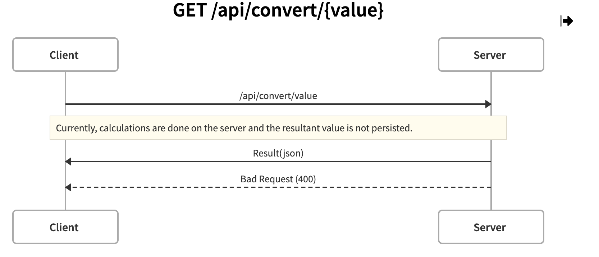

# Decimal to Hexadecimal calculator

This is an API which when requested with a value, will return the hexadecimal equivalent.

It is out of the box user friendly and ready to use or alternatively you can use the already hosted version (see below).

## API Diagrams:

### GET /api/convert/:value

## Getting Started

You can either clone the repo directly and run the `npm start` command or alternatively if you would just like to use the hosted api then documentation can be found [here](https://decimal-to-hexadecimal.herokuapp.com/api-docs/api-docs)

### Tests:

Tests can be run with the `npm test` command

### To do:

- Update Homepage
- Add typescript
- Add dockerfile
